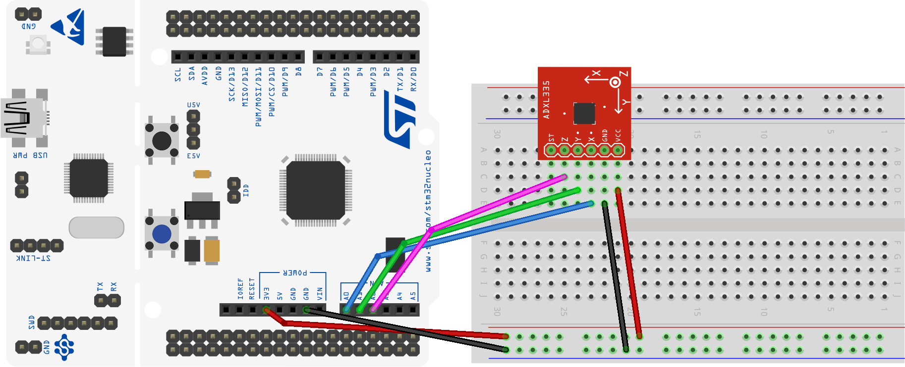
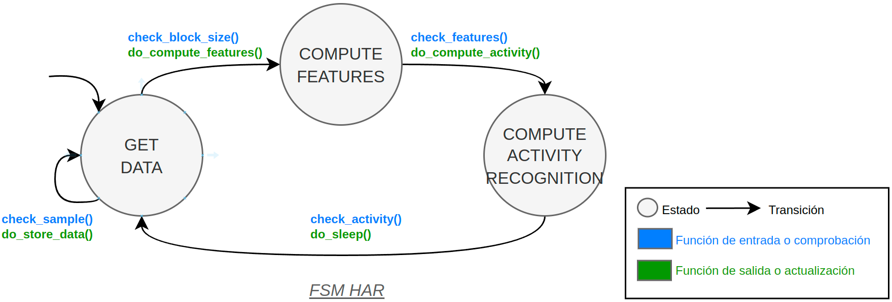

# HAR system with FSM and ADC

Este proyecto implementa un sistema HAR con un sensor analógico de acelerometría ADXL335 para reconocimiento de actividad usando un modelo de *Machine Learning* kNN. El sistema utiliza el periférico ADC para muestrear los tres ejes XYZ del sensor, aunque también permite trabajar con datos de ejemplo guardados en memoria.

> **Para utilizar los datos en memoria, se debe dejar descomentada** la línea `#define USE_ADC_STORED` en el archivo `adc_data_store.h`.

La canfiguración del HW se muestra en la siguiente imagen:

El sistema usa una FSM para gestionar los diferentes estados del sistema y el hardware. Esta imagen muestra la FSM del sistema:

El sistema toma una medida de cada eje del acelerómetro cada vez que su temporizador es activado. La medida se realiza mediante el periférico ADC. El ADC está configurado para muestrear en modo único. El temporizador está configurado en el archivo `PORT` del sistema.

| Parameter     | Value                         |
| ------------- | ----------------------------- |
| Define label  | HAR_SYSTEM_TIMER              |
| Timer         | TIM2                          |
| Interrupt     | TIM2_IRQHandler()             |
| Time interval | SAMPLING_PERIOD_ACCEL seconds |
| Priority      | 2                             |
| Subpriority   | 0                             |

Puedes acceder al código fuente de este proyecto en el siguiente enlace: [HAR system with FSM and ADC](https://github.com/ieinDieUpm/fsm_har).

## Implementación HW

## Sensor de acelerometría

El sensor de acelerometría utilizado en el sistema es el ADXL335 (ver [datasheet ADXL335](https://www.analog.com/media/en/technical-documentation/data-sheets/ADXL335.pdf)). El sensor está conectado a tres pines del microcontrolador. El sensor está configurado como una entrada analógica sin resistencia de pull-up ni pull-down. El sensor se muestrea en modo único con un periodo de muestreo dado por las interrupciones de un temporizador. Todas las configuraciones del ADC son por defecto. El ADC está configurado para interrumpir cuando la conversión se completa. El ADC está configurado con los siguientes ajustes:

| Parameter       | Value              |
| --------------- | ------------------ |
| Variable name   | har_sensor.x       |
| Pin X           | PA0 (A0 on Nucleo) |
| ADC Z           | ADC1               |
| Channel X       | 0                  |
| Mode X          | Analog             |
| Pull up/ down X | No push no pull    |
| ISR             | ADC_IRQHandler()   |
| Priority        | 1                  |
| Subpriority     | 0                  |

| Parameter       | Value              |
| --------------- | ------------------ |
| Variable name   | har_sensor.y       |
| Pin Y           | PA1 (A1 on Nucleo) |
| ADC Y           | ADC1               |
| Channel Y       | 1                  |
| Mode Y          | Analog             |
| Pull up/ down Y | No push no pull    |
| ISR             | ADC_IRQHandler()   |
| Priority        | 1                  |
| Subpriority     | 0                  |

| Parameter       | Value              |
| --------------- | ------------------ |
| Variable name   | har_sensor.z       |
| Pin Z           | PA4 (A2 on Nucleo) |
| ADC Z           | ADC1               |
| Channel Z       | 4                  |
| Mode Z          | Analog             |
| Pull up/ down Z | No push no pull    |
| ISR             | ADC_IRQHandler()   |
| Priority        | 1                  |
| Subpriority     | 0                  |

## Funcionamiento detallado del sistema

El sistema está codificado según el diagrama de estados mostrado anteriormente. El sistema se comporta de la siguiente manera:

* El sistema se inicia en el estado `GET_DATA`. En este estado espera a que el temporizador active la interrupción, active el ADC y muestree los datos del acelerómetro. Si se están usando los datos simulados, se obtienen los datos de la memoria (arrays `ADC_STORED_ACC_X`, `ADC_STORED_ACC_Y` y `ADC_STORED_ACC_Z`). En la ISR del temporizador se activa el *flag* `samples_available` del `har_sensor` para indicar que los datos están listos para ser almacenados.
* Los datos se almacenan en el estado `GET_DATA`, en la función `do_store_data()`, en el array `acc_block` de la estructura de la FSM.
* Cuando se han almacenado `WINDOW_SIZE_SAMPLES` datos, se activa el *flag* `acc_block_available` de la FSM y se cambia al estado `COMPUTE_FEATURES`.
* En el estado `COMPUTE_FEATURES`, se calculan las características de los datos almacenados en `acc_block` y se almacenan en `features` de la FSM. Se calculan las características de: media, varianza, desviación estándar, valor máximo, valor mínimo, amplitud y mediana. Cuando se han calculado todas las características, se activa el *flag* `features_available`, se limpia el *flag* `acc_block_available` y se cambiará al estado `COMPUTE_ACTIVITY_RECOGNITION`.
* En el estado `COMPUTE_ACTIVITY_RECOGNITION`, se ha inferido la actividad del usuario a partir de las características calculadas en el estado anterior con la función de salida `do_compute_activity()`. Se calcula la distancia euclidiana entre las características (*features*) calculadas y los centroides del modelo almacenado. Se almacena el índice de la actividad inferida en el array de históricos `activities_detected` de la FSM. Por último, guarda en la variable `last_activity_name` el nombre de la actividad inferida. Cuando se ha inferido la actividad, se limpia el *flag* `features_computed` y se vuelve al estado inicial `GET_DATA`.
* En esta última transición a `GET_DATA`, se llama a la función de salida `do_sleep()`, que pone el sistema en modo de bajo consumo. Dormirá hasta que se active la interrupción del temporizador, cogerá el dato, y volverá a dormir. El sistema se mantiene despierto durante el cálculo de las características y la inferencia de la actividad.

Se proporcionan trazas de depuración en la consola para mostrar el estado actual del sistema y las actividades inferidas.

Vaya al [ejercicio](ejercicio.md) para realizar los cambios necesarios para que funcione correctamente.

## References

- **[1]**: [Documentation available in the Moodle of the course](https://moodle.upm.es/titulaciones/oficiales/course/view.php?id=785#section-0)
- **[2]**: [Embedded Systems with ARM Cortex-M Microcontrollers in Assembly Language and C (Fourth Edition)](https://web.eece.maine.edu/~zhu/book/index.php) for explanations and examples of use of the ARM Cortex-M microcontrollers in C with CMSIS.
- **[3]**: [Programming with STM32: Getting Started with the Nucleo Board and C/C++](https://ingenio.upm.es/primo-explore/fulldisplay?docid=34UPM_ALMA51126621660004212&context=L&vid=34UPM_VU1&lang=es_ES&search_scope=TAB1_SCOPE1&adaptor=Local%20Search%20Engine&tab=tab1&query=any,contains,Programming%20with%20STM32:%20Getting%20Started%20with%20the%20Nucleo%20Board%20and%20C%2FC%2B%2B&offset=0) for examples of use of the STM32 microcontrollers with the HAL of ST.
- **[4]**: [The C Programming Language](https://ingenio.upm.es/primo-explore/fulldisplay?docid=34UPM_ALMA2151866130004212&context=L&vid=34UPM_VU1&lang=es_ES&search_scope=TAB1_SCOPE1&adaptor=Local%20Search%20Engine&isFrbr=true&tab=tab1&query=any,contains,C%20Programming%20Language)
- **[5]**: [Nucleo Boards Programming with th STM32CubeIDE](https://www.elektor.com/products/nucleo-boards-programming-with-the-stm32cubeide) for examples of use of the STM32 microcontrollers with the STM32CubeIDE.
